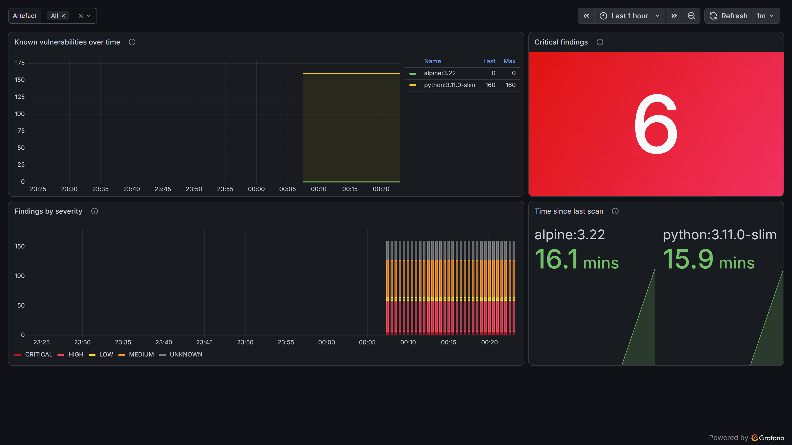

# drift-platform

Runs [`sbomdrift`](https://github.com/EngineerSamet/sbomdrift) as a scheduled
Kubernetes workload, and turns its output into a dashboard you can watch and an
alert that pages you.

`sbomdrift` on its own answers *what became vulnerable since last time* from a
command line. This repository is the other half of that sentence: **who is
watching, and how do they find out.** It is where the tool stops being something
you run and becomes something that runs.

---

## What it does

A `CronJob` scans a fleet of images every night. For each image it generates an
SBOM with Syft, ingests it, evaluates it against OSV.dev, and publishes the
result as Prometheus metrics through a Pushgateway. Grafana draws the drift over
time; Prometheus alerting rules fire when something new turns critical, or when
the scan itself goes quiet.



*Live from a real run: `python:3.11.0-slim` carrying 6 CRITICAL and 160 total
findings, `alpine:3.22` clean, and the age of each artefact's last scan.*

```
        CronJob (nightly)
   syft → ingest → eval → metrics
              │
              ▼  push
        Pushgateway ──scrape──► Prometheus ──► Grafana  (drift over time)
                                    │
                                    └────────► Alertmanager  (new CRITICAL / scan stale)
```

Nothing about the scanned images changes between runs. What changes is the
advisory data — which is exactly the drift the tool exists to surface, and which
a one-shot scanner cannot show because it has no yesterday to compare against.

---

## Why these shapes

Every non-obvious choice is written down beside the thing it governs; the load-bearing ones:

- **A `CronJob`, not a `Deployment`.** A scan is periodic and finite. Modelling
  it as a long-running pod means writing a scheduler Kubernetes already has, and
  paying for a container that idles all day.
- **A Pushgateway, not a scrape target.** A batch job has exited by the time
  Prometheus would scrape it. Batch jobs push. The cost — the gateway serves the
  last value forever — is why a *staleness* metric exists, so a stopped scan
  stays detectable even though its numbers never disappear.
- **`concurrencyPolicy: Forbid` + `ReadWriteOnce`.** The history is one SQLite
  file, and SQLite's locking does not survive two writers. A slow run delays the
  next rather than racing it.
- **The scan runs unprivileged, read-only root, no Docker socket.** Syft reads
  images straight from the registry API; handing a scan job the host's container
  runtime is a far larger privilege than the task needs.
- **`helm.sh/resource-policy: keep` on the volume.** The history is the product;
  `helm uninstall` must not throw months of it away.

---

## Install

Requires a cluster with the Prometheus operator CRDs (kube-prometheus-stack).

```bash
# 1. Monitoring stack (Prometheus, Grafana, Alertmanager, Pushgateway)
helm repo add prometheus-community https://prometheus-community.github.io/helm-charts
helm install monitoring prometheus-community/kube-prometheus-stack \
  -n observability --create-namespace \
  -f observability/kube-prometheus-stack.values.yaml
helm install drift-pushgateway prometheus-community/prometheus-pushgateway \
  -n observability --set serviceMonitor.enabled=true

# 2. The drift dashboard (imported by the Grafana sidecar because it is labelled)
kubectl apply -f observability/dashboard-configmap.yaml -n observability

# 3. The scan image, then the chart
docker build -t sbomdrift-scan:0.1.3 .
helm install drift charts/sbomdrift -n drift --create-namespace \
  --set 'fleet={python:3.11-slim,python:3.11.0-slim,nginx:1.29-alpine}'
```

On a local **k3d** cluster, load the image into the cluster instead of pushing
to a registry: `k3d image import sbomdrift-scan:0.1.3 -c <cluster>`.

## Run it now, without waiting for 02:00

```bash
kubectl create job --from=cronjob/drift-sbomdrift run-now -n drift
kubectl logs -n drift -l job-name=run-now -f
```

Measured on a real run of this chart: `python:3.11.0-slim` reported **6 CRITICAL
and 52 HIGH** findings, and the metrics landed in Prometheus within one scrape.

## When something breaks

See [RUNBOOK.md](RUNBOOK.md). Every entry there was hit for real while building
this — including the `UNIQUE constraint failed: evaluations.label` crash that a
second daily run exposed, which was then fixed upstream in `sbomdrift` 0.1.3.

---

## Layout

```
Dockerfile                     the scan image: sbomdrift + syft, SHA-pinned, unprivileged
charts/sbomdrift/              the Helm chart — CronJob, PVC, scan ConfigMap, PrometheusRule
observability/
  kube-prometheus-stack.values.yaml   a small monitoring stack sized for one node
  dashboard-drift.json                the Grafana dashboard, as code
  dashboard-configmap.yaml            it, wrapped for the sidecar to import
RUNBOOK.md                     what to do when an alert fires
```

## Licence

Apache-2.0.
